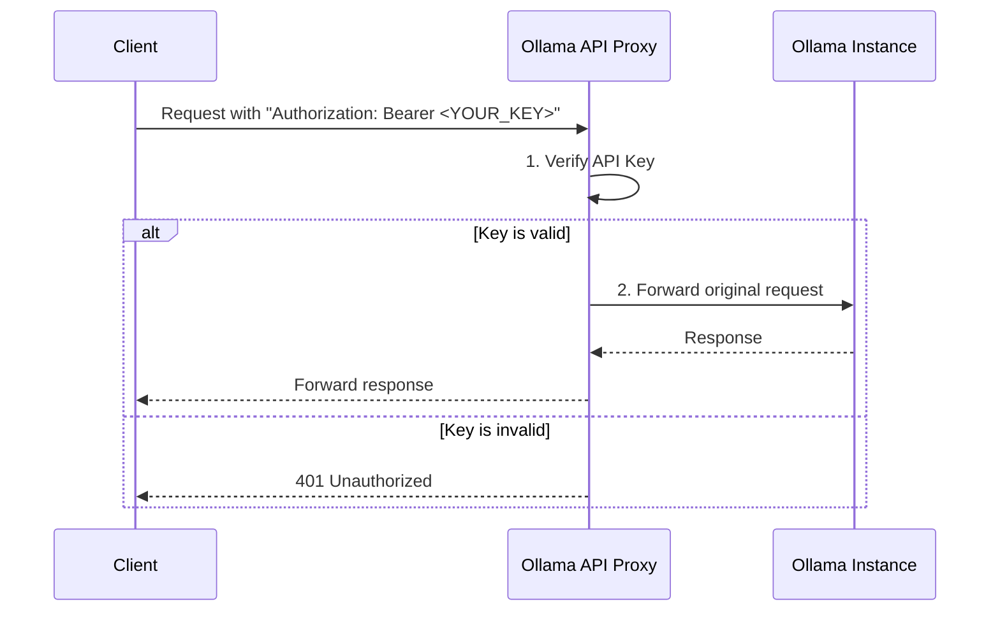

# 🛡️ Ollama API Proxy

A simple yet powerful proxy server for [Ollama](https://ollama.com/) that allows you to secure API access with a private **Bearer Token**. It's the perfect solution if you want to expose your Ollama instance on a local network or the internet safely.

## ✨ Why use this?

By default, the Ollama API is open and accessible to anyone on the same network. This project acts as a **"gatekeeper"** – it sits between the user and the Ollama server, verifying that every request includes a valid API key.

**Primary use case:**

* You have an Ollama server running on one machine.
* You want to securely access its API from another machine, an application, or even through a Cloudflare tunnel, without exposing it to the entire world.

## 🚀 Key Features

* **Security:** Protects Ollama API access with a Bearer Token.
* **Full Forwarding:** Forwards all requests (including parameters and body) to Ollama, with full support for streaming responses (`stream: true`).
* **Easy Deployment:** Ready-to-use configuration with Docker and Docker Compose.
* **Lightweight:** Built on the fast FastAPI framework.

## ⚙️ How It Works

The request flow is straightforward:



## 🛠️ Installation and Setup

The project is fully containerized, so all you need is Docker.

### Prerequisites

* [Docker](https://www.docker.com/get-started)
* [Docker Compose](https://docs.docker.com/compose/install/)

### Steps

1.  **Clone the repository:**
    ```bash
    git clone https://github.com/rafalgawlik/ollama-proxy.git
    cd ollama-proxy
    ```

2.  **Configure `docker-compose.yml`:**
    Open the `docker-compose.yml` file and customize the environment variables:
    ```yaml
    services:
      proxy:
        build: .
        ports:
          - "8087:8087"
        environment:
          # CHANGE TO YOUR OWN SECRET API KEY!
          - PROXY_API_KEY=supersecret 
          # ENTER THE CORRECT URL OF YOUR OLLAMA INSTANCE
          - OLLAMA_URL=http://your-ollama:11434 
        restart: unless-stopped
    ```
    * `PROXY_API_KEY`: Set your own unique key here.
    * `OLLAMA_URL`: Enter the IP address and port where your Ollama instance is running.

3.  **Build and run the container:**
    In the main project folder, run the following command:
    ```bash
    docker-compose up --build -d
    ```
    The proxy will now be running on port `8087` of the machine you launched it on.

## 💡 Usage Examples

To send a request to Ollama through the proxy, you need to add the `Authorization` header with your key.

### Streaming Request (`stream: true`)

```bash
curl http://localhost:8087/api/generate \
  -H "Content-Type: application/json" \
  -H "Authorization: Bearer supersecret" \
  -d '{
    "model": "llama3",
    "prompt": "Why is the sky blue?",
    "stream": true
  }'
```
> **Note:** Remember to replace `supersecret` with your API key and `localhost` with the IP address of the machine running the proxy.

### Standard Request (`stream: false`)

```bash
curl http://localhost:8087/api/generate \
  -H "Content-Type: application/json" \
  -H "Authorization: Bearer supersecret" \
  -d '{
    "model": "llama3",
    "prompt": "Why is the sky blue?",
    "stream": false
  }'
```

## 📂 Project Structure

```
.
├── docker-compose.yml  # Defines the proxy service, environment variables, and network
├── Dockerfile          # Instructions for building the app's Docker image
├── main.py             # The main application logic in FastAPI
└── requirements.txt    # Python dependencies
```

---

Made with ❤️ using Python, FastAPI, and Docker.
